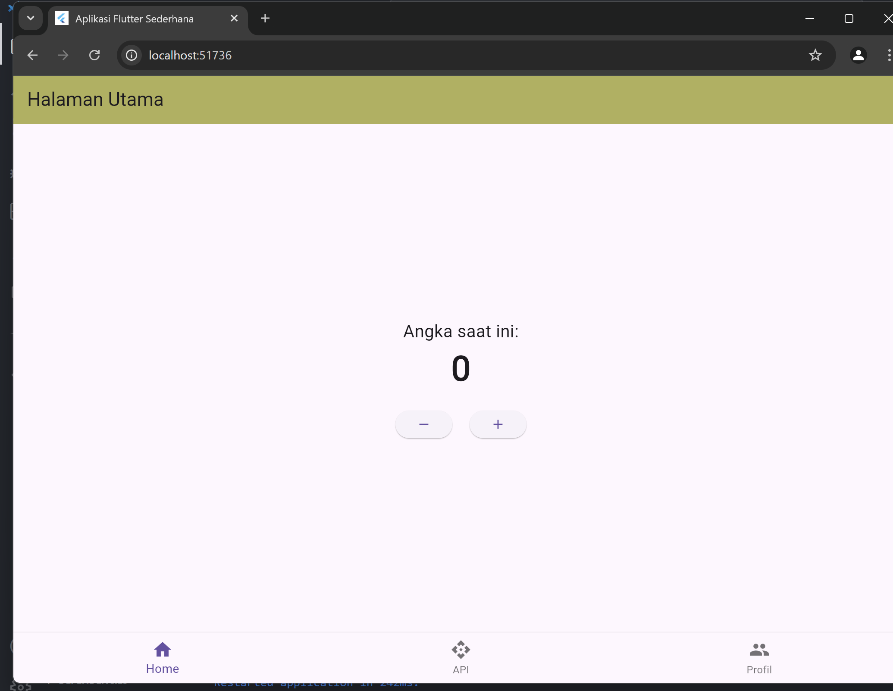
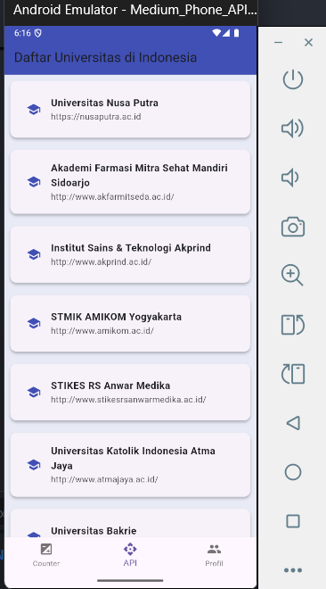
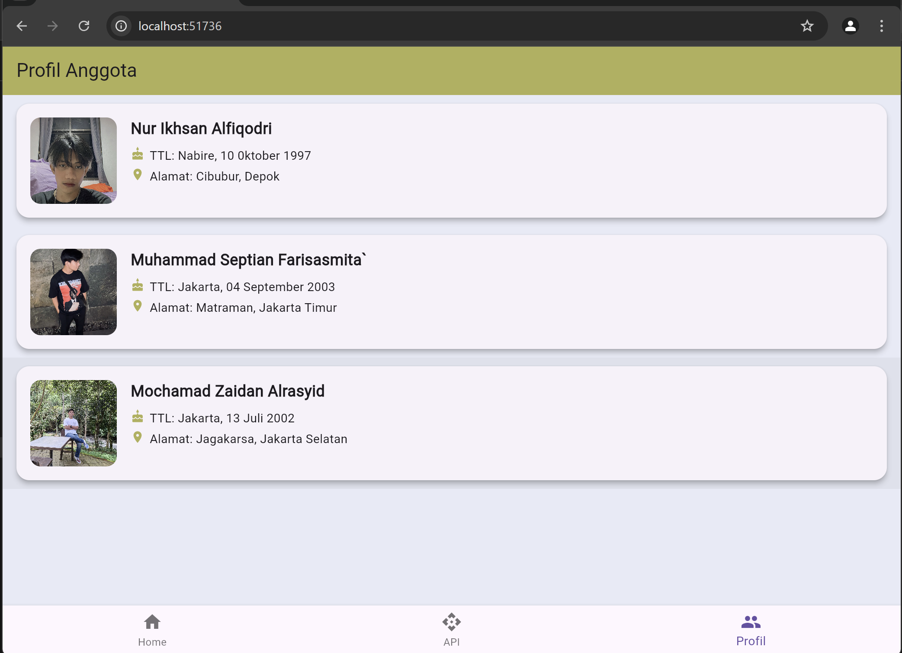

# flutter_aplikasi_sederhana
# Aplikasi Flutter 3 Halaman - Kelompok 9

## Anggota Kelompok:
- Nama: Nur Ikhsan Alfiqodri, NIM: 4522210114
- Nama: Muhammad septian Farisasmita, NIM: 4522210124
- Nama: Mochammad Zaydan Al Rasyid, NIM: 452210118

## Deskripsi Aplikasi:
Aplikasi ini berisi 3 halaman, yaitu:
1. Halaman Utama.
2. Menampilkan data dari API.
3. Profile anggota kelompok.

## Screenshot Halaman:
### Halaman Utama

### Halaman API

### Halaman Profile

## Penjelasan Tiap Halaman:
- **Halaman Utama:**  
    *Menampilkan angka yang dapat bertambah saat tombol "+" ditekan dan menampilkan angka yang dapat berkurang saat tombol "-" ditekan.*
- **Halaman API:** 
    *Menampilkan API data Universitas di Indonesia dalam bentuk list dan ketika ditekan salah satu Universitas, menampilkan data dalam bentuk card.*
- **Halaman Profile:**
    *Menampilkan data anggota tim dalam bentuk card. Setiap card berisi nama, ttl(tempat tanggal lahir), dan alamat anggota tim.*

## Cara Menjalankan Aplikasi:
flutter pub get flutter run
